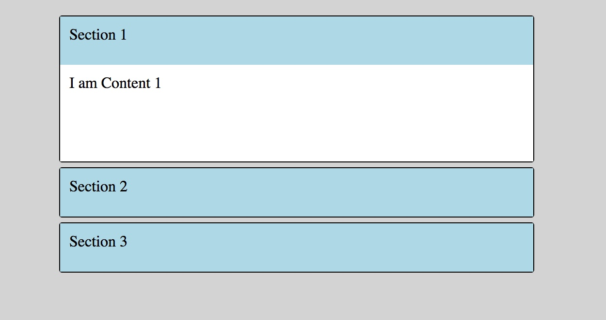
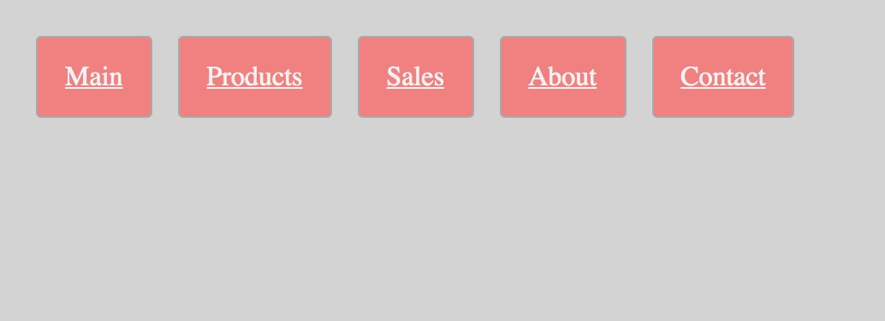
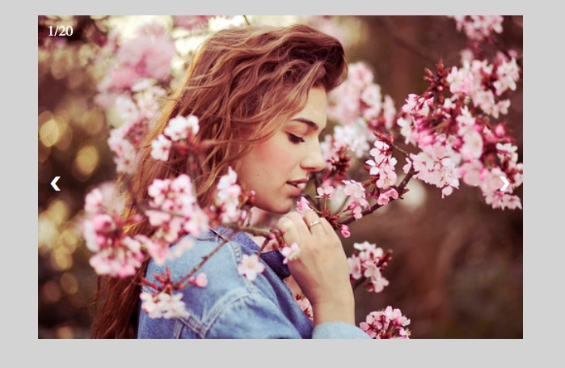
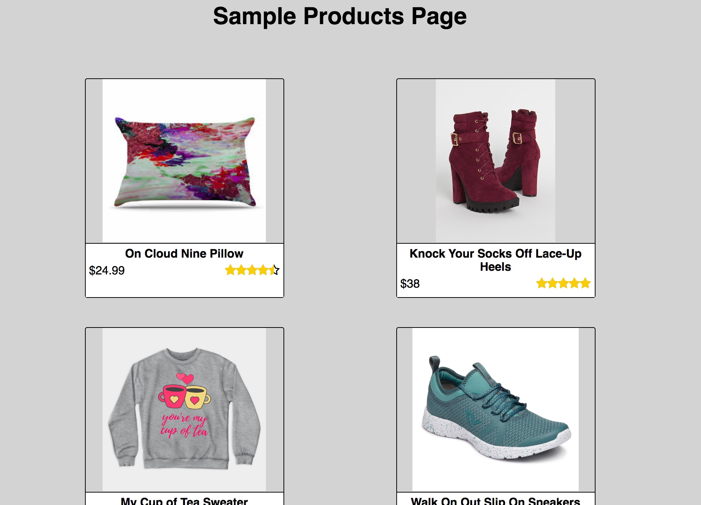

# Components-Design
A fun ongoing project - Components design using HTML, CSS, Javascript, NodeJs 

## Setup
1. Clone the project
2. run ```npm install``` from the root folder, which will install all the node dependencies found in package.json by creating node_modules folder
3. start server using command ``` npm run dev```
4. for slideshow component - You will have to get flickr api key and use that in 'server.js' file to fetch the photos from the collection

### Accordion 


### Responsive Navigation Bar


### Slideshow 


### Products Card

